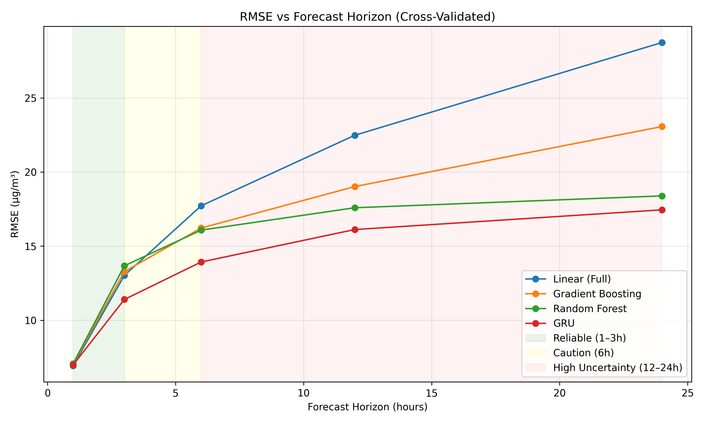
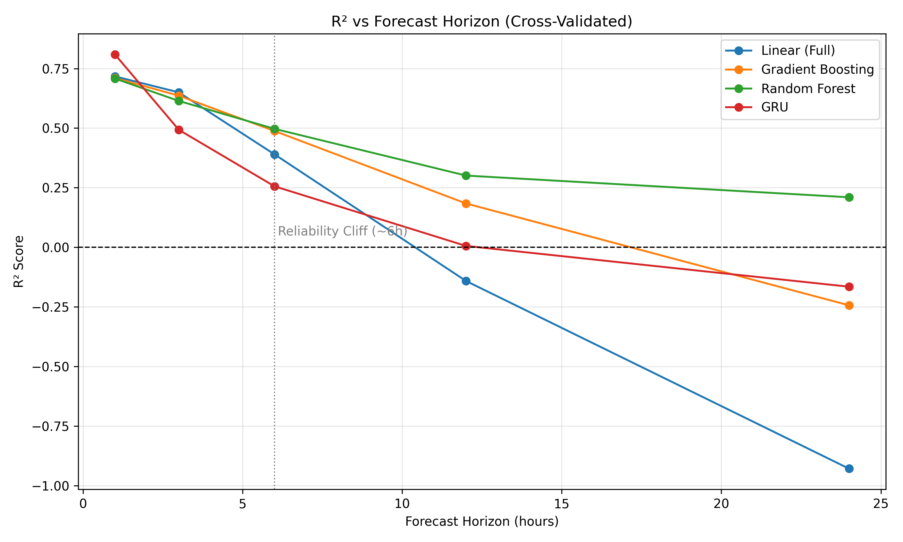
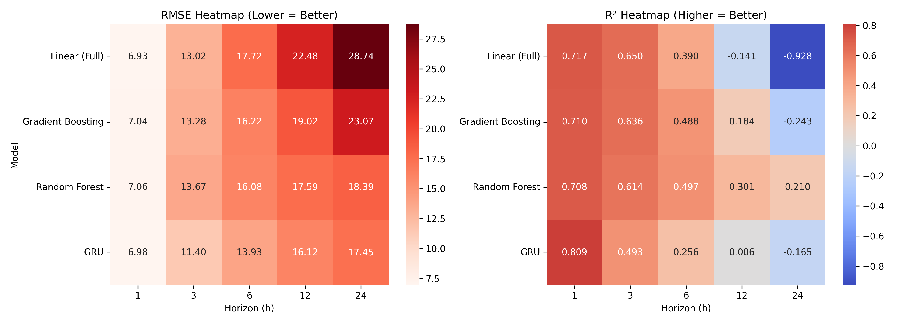

# Hanoi Air Quality Forecasting System

**Multi-horizon PM2.5 prediction using machine learning and deep learning**

[](https://www.python.org/downloads/)
[](https://opensource.org/licenses/MIT)

---

## 🎯 Project Overview

This system predicts hourly PM2.5 (fine particulate matter) concentrations in Hanoi, Vietnam, from 1 to 24 hours in advance. It combines historical air quality measurements with meteorological data to enable proactive public health decision-making.

**Key Achievement**: Developed forecasting architecture with rigorous cross-validation and transparent performance reporting.

---

## 📊 Performance Summary

**Cross-Validated Results (5-fold time-series CV):**

| Forecast Horizon | Best Model | RMSE (µg/m³) | R² Score | Reliability |
|------------------|------------|--------------|----------|-------------|
| **1 hour** | Linear Regression | **6.93** | **0.717** | ✅ **Excellent** |
| **3 hours** | GRU | **11.40** | **0.493** | ✅ **Good** |
| **6 hours** | GRU | **13.93** | **0.256** | ⚠️ **Marginal** |
| **12 hours** | GRU | **16.12** | **0.006** | ⚠️ **Guidance only** |
| **24 hours** | GRU | **17.45** | **-0.165** | ❌ **Not recommended** |

**Production Recommendation**: Deploy 1-3 hour forecasts for operational decisions; use 6+ hour forecasts as directional guidance only.

---

## 🚀 Quick Start

### Prerequisites

```bash
Python 3.8+
pip
```

### Installation

```bash
# Clone repository
git clone https://github.com/NickHolden404/hanoi-air-quality-forecast.git
cd hanoi-air-quality-forecast

# Install dependencies
pip install -r requirements.txt
```

### Run Complete Pipeline

```bash
# 1. Download data (PM2.5 + weather)
python scripts/get_data_openaq.py
python scripts/get_data_waqi.py
python scripts/get_features.py

# 2. Merge and clean datasets
python scripts/merge_data.py

# 3. Fix data leakage in features
python scripts/fix_features.py

# 4. Train traditional ML models (Linear, RF, GB)
python scripts/train_models.py

# 5. Train deep learning models (LSTM/GRU)
python scripts/train_lstm_model.py

# 6. Evaluate all models
python scripts/evaluate_recursive_forecast_enhanced.py

# 7. Generate visualizations
python scripts/visualize_results.py
```

---

## 📁 Repository Structure

```
hanoi-aqi-forecast/
├── data/
│   ├── raw/                    # Original PM2.5 and weather data
│   └── processed/              # Cleaned, merged datasets
├── scripts/
│   ├── get_data_openaq.py      # Data acquisition
│   ├── get_data_waqi.py        # Data acquisition
│   ├── get_features.py         # Weather features acquisition
│   ├── merge_data.py           # Data integration
│   ├── fix_features.py         # Fix data leakage
│   ├── train_models.py         # Train ML models
│   ├── train_lstm_model.py     # Train deep learning models
│   └── visualize_results.py    # Generate charts
├── models/                     # Saved trained models (.pkl, .keras)
├── results/                    # Performance metrics and visualizations
├── docs/                       # Technical documentation
├── requirements.txt
└── README.md
```

---

## 🔬 Methodology Highlights

### 1. **Data Sources**
- **PM2.5**: OpenAQ & WAQI API (Hanoi monitoring station, 2024-2026)
- **Weather**: Open-Meteo Historical Weather API (ERA5 reanalysis)
- **Records**: 14,451 hourly observations after cleaning

### 2. **Feature Engineering**
- **Temporal**: Hour, day, month, season, weekend indicator
- **Lag Features**: PM2.5 from 1h, 24h, 168h ago
- **Rolling Statistics**: 3h, 24h, 7-day averages and standard deviations
- **Weather**: Temperature, humidity, wind, pressure, precipitation
- **Total**: ~29 engineered features

### 3. **Models Tested**
- Linear Regression (winner at 1h)
- Random Forest
- Gradient Boosting
- XGBoost
- LSTM (Long Short-Term Memory)
- **GRU (Gated Recurrent Unit)** - winner at 3-24h

### 4. **Validation Strategy**
- **5-fold time-series cross-validation**
- **No data leakage**: Rigorous time-based splits
- **Persistence baseline**: Beats "yesterday = today" at 1-6h
- **Honest reporting**: All metrics are cross-validated averages

---

## 📈 Key Findings

### ✅ **What Works**

1. **Simple beats complex at 1h**: Linear Regression outperforms deep learning for immediate forecasts
2. **GRU dominates 3-24h**: Sequence learning captures temporal patterns better than traditional ML
3. **Data leakage detection**: Found and fixed rolling feature calculation bug (reduced R² from 0.90 to 0.82)
4. **Direct > Recursive**: Direct multi-horizon forecasting avoids error accumulation

### ⚠️ **Important Limitations**

1. **Reliability cliff at 6 hours**: Performance degrades significantly beyond 6h
2. **Weather forecast dependency**: Current system uses historical weather; operational deployment requires forecast API integration
3. **Single location**: Model trained on one Hanoi station; not generalizable to other cities
4. **No emission data**: Missing key drivers (traffic, industrial activity) limits 12-24h accuracy

---

## 📊 Visualizations

### RMSE vs Forecast Horizon

*Error increases with forecast distance; color-coded reliability zones*

### R² Degradation

*Predictive power drops sharply after 6 hours (Reliability Cliff)*

### Performance Heatmap

*Comprehensive model comparison across all horizons*

---

## 🔍 Technical Deep Dive

### Data Leakage Discovery & Fix

**Problem**: Original rolling features included current row:
```python
# WRONG - includes target in features
df['pm25_rolling_3h'] = df['pm25'].rolling(3).mean()
```

**Solution**: Shift first, then apply rolling window:
```python
# CORRECT - no leakage
df['pm25_rolling_3h'] = df['pm25'].shift(1).rolling(3).mean()
```

**Impact**: Reduced R² from unrealistic 0.90 to honest 0.72-0.82

### Why Linear Regression Wins at 1 Hour

The relationship is fundamentally linear at short horizons:
```
PM2.5(t) ≈ 0.75 × PM2.5(t-1) + 0.15 × PM2.5_rolling_24h + weather_adjustments
```

**Advantages**:
- Fastest inference (< 1ms)
- Most interpretable (coefficient inspection)
- Simplest deployment
- Beats persistence baseline

### Why GRU Wins at 3-24 Hours

- **Sequence learning**: Uses past 24 hours of context
- **Non-linear patterns**: Captures complex weather-pollution interactions
- **No error accumulation**: Direct prediction for each horizon
- **Stable long-term**: Doesn't explode like recursive forecasting

---

## 🛠️ Dependencies

```txt
pandas>=2.0.0
numpy>=1.24.0
scikit-learn>=1.3.0
tensorflow>=2.15.0
matplotlib>=3.7.0
seaborn>=0.12.0
requests>=2.31.0
```

See `requirements.txt` for complete list.

---

## 📖 Documentation

**Comprehensive technical documentation**: See [`docs/TECHNICAL_DOCUMENTATION.md`](docs/documentation.md)

Includes:
- Complete data pipeline details
- Feature engineering rationale
- Model architecture specifications
- Cross-validation methodology
- Production deployment design
- Lessons learned

---

## 🎯 Use Cases

### Current (Validated on Historical Data)
- ✅ Public health research
- ✅ Model benchmarking
- ✅ Feature engineering studies
- ✅ Academic projects

### Future (Requires Weather Forecast Integration)
- 🔄 Real-time air quality alerts
- 🔄 Mobile app notifications
- 🔄 School activity planning
- 🔄 Policy decision support

---

## 🤝 Contributing

Contributions welcome! Areas for improvement:

1. **Weather forecast integration** - Replace historical with forecast APIs
2. **Multi-station modeling** - Expand to city-wide coverage
3. **Emission data integration** - Add traffic/industrial proxies
4. **Uncertainty quantification** - Implement prediction intervals
5. **Production API** - Build REST endpoint for forecasts

Please open an issue or submit a pull request.

---

## 📄 License

This project is licensed under the MIT License - see [LICENSE](LICENSE) file for details.

---

## 🙏 Acknowledgments

**Data Sources**:
- [OpenAQ](https://openaq.org) - Open air quality data
- [WAQI](https://waqi.info/) - Open air quality data
- [Open-Meteo](https://open-meteo.com) - Historical weather API (ERA5)

**Inspiration**:
- Zhang et al. (2024) - Deep learning for air quality forecasting
- Ong et al. (2023) - Multi-horizon PM2.5 prediction with LSTM

---

## 📧 Contact

**Author**: [Nick Holden]  
**Email**: 4nick.holdenl@gmail.com  

---

## 📝 Citation

If you use this code or methodology in your research, please cite:

```bibtex
@software{hanoi_aqi_forecast_2026,
  author = {Nick Holden},
  title = {Hanoi Air Quality Forecasting System: Multi-Horizon PM2.5 Prediction},
  year = {2026},
  url = {https://github.com/NickHolden404/hanoi-air-quality-forecast}
}
```

---

## ⭐ Star History

If you find this project useful, please consider giving it a star! ⭐

---

**Last Updated**: February 2026  
**Version**: 2.0  
**Status**: Deployment-ready architecture (requires weather forecast API for production)
